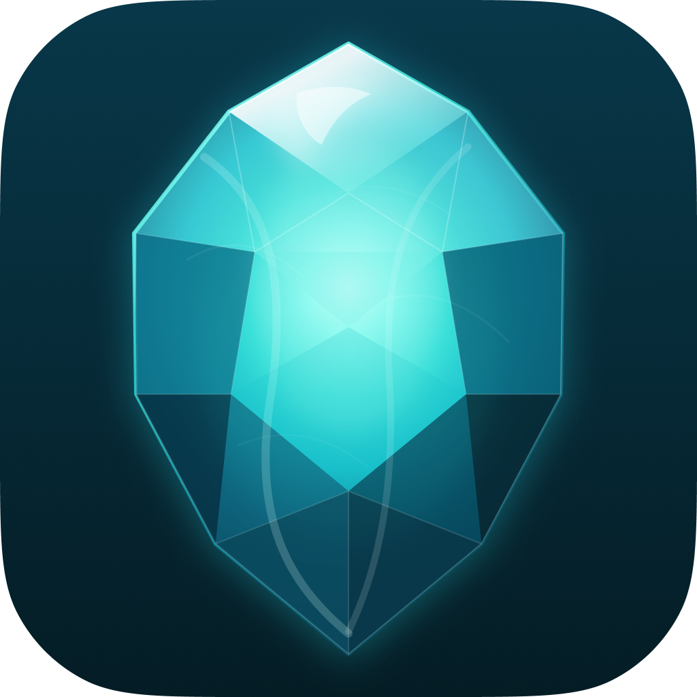

# Turmalina

Markdown notes.

## 🚀 Features

Coming soon...

# 📦 Technologies

- Backend: [Dart](https://dart.dev/)
- Backend: [Rust](https://rust-lang.org)
- Frontend: [Flutter](https://flutter.dev/)

## 🧑‍💻 Contributing

🚫 This project is not accepting external contributions at the moment while core development is still in progress. Stay tuned for updates!

## 📄 License
This project is licensed under the AGPL-3.0 License. See [LICENSE](https://github.com/turmalina-md/.github/blob/main/LICENSE) for more details.
